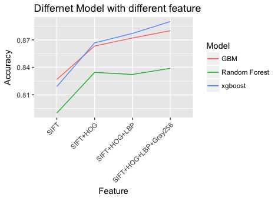

# Project: Dogs, Fried Chicken or Blueberry Muffins?


### [Full Project Description](doc/project3_desc.md)

Term: Fall 2017

+ Team #3
+ Team members
	+ Chaoyue Tan
    + Han Lin 
    + Hongyang Yang
    + Peilin Qiu
    + Wyatt Thompson


+ Project summary: In this project, we created a classification engine for images of dogs versus fried chicken versus blueberry muffins.
First, we researched on several classification medels including gbm, xgboost, random forest, logistic regression, lasso, nueral network, svm and cnn. Next, we test different ways of feature extraction including sift, hog, pca, lbp and cnn and use the features we got to work with different models. Finally, we found the most efficient solution of this problem is using model xgboost and feature sift+hog+lbp.




**Contribution statement**: ([default](doc/a_note_on_contributions.md)) All team members approve our work presented in this GitHub repository including this contributions statement. 

+ Peilin: designed SIFT with PCA as feature extraction. Tried to develop CNN feature extraction together with Chaoyue but failed. Carried out the Lasso and Random Forests model and tested them on various features. Helped finish the final report.

Following [suggestions](http://nicercode.github.io/blog/2013-04-05-projects/) by [RICH FITZJOHN](http://nicercode.github.io/about/#Team) (@richfitz). This folder is orgarnized as follows.

```
proj/
├── lib/
├── data/
├── doc/
├── figs/
└── output/
```

Please see each subfolder for a README file.
